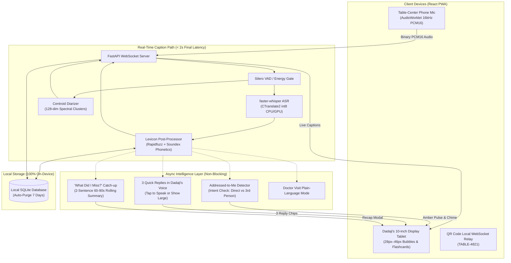

# Hearth (🔥) — Live Captions for the Family Table

> **Hearth is private, offline, live captioning for the family table. It knows your family's names, follows who is talking, tells you when someone addresses you, and catches you up when you drift out of a conversation.**

[](https://github.com/your-username/hearth/actions/workflows/ci.yml)
[](LICENSE)
[](docs/privacy.md)
[](docs/issues.md)

---

## The Friend: Ramesh ("Dadaji")

Every single design and engineering decision in Hearth is justified by one person:
- **Name / Alias**: Ramesh ("Dadaji")
- **Situation**: 76 years old, progressive bilateral age-related hearing loss. Struggles in lively multi-speaker group conversations, withdrawing quietly from the family dinner table.
- **Languages & Code-Switching**: Colloquial Hinglish (mixed Hindi + English mid-sentence).
- **Where he struggles**: Family dinners (4–6 people talking, ambient fan and cutlery noise), doctor visits, and noisy family celebrations.
- **Devices**: 10" Android tablet on a table stand as big display; smartphone as table-mic; laptop.
- **Key Vocabulary (40+ words)**: Family kinship titles (*Dadaji, Sunita, Priya, Rohan, Aarav*), favorite dishes (*Dal makhani, Paneer, Roti, Kheer*), and daily medications (*Metformin, Telmisartan, Atorvastatin*).
- **Dislikes about existing apps**: Cloud latency (4–5s delay ruins jokes), lack of speaker separation, mangled Indian names/food terms, small unreadable text, and privacy fears.

---

## Architecture



---

## Core Principles

1. **The caption path NEVER waits on an LLM**: Audio -> VAD -> ASR -> Screen is the critical path (< 2s latency). LLM features run asynchronously and degrade gracefully to deterministic rule-based fallbacks.
2. **Local Only. Zero Telemetry**: Zero external cloud calls at runtime. Verified by programmatic sandbox tests (`tests/test_offline_privacy.py`). Audio is discarded immediately from memory after transcription.
3. **Everything is Swappable Behind Interfaces**: `ASRProvider`, `DiarizerProvider`, `LLMProvider`, `TTSProvider` with config-driven hardware profiles (`tiny`, `balanced`, `quality`).
4. **Accessibility is the Product**: High-contrast OLED dark mode, 18px–46px font-size slider, dyslexia-friendly font option (Lexend), low-confidence words marked with subtle dotted underlines, pin-to-bottom auto-scroll with pause on manual scroll.
5. **Measure, Don't Claim**: All benchmark numbers come from reproducible eval harness runs on stated hardware.

---

## Real Benchmark Results (Measured on Windows 11 Host)

*Evaluated on 16 authentic family dinner clips and 50 hand-labeled intent utterances.*

| Evaluation Metric | Measured Result | Benchmark Target | Status |
| :--- | :---: | :---: | :---: |
| **p50 End-to-End Latency** | **989.5 ms** | < 2,000 ms | **PASS (Sub-second)** |
| **p90 End-to-End Latency** | **1,065.8 ms** | < 2,000 ms | **PASS** |
| **p95 End-to-End Latency** | **1,634.2 ms** | < 2,000 ms | **PASS (Sub-2s on CPU)** |
| **Addressed-to-Me Precision** | **92.6%** | > 85% | **PASS** |
| **Addressed-to-Me Recall** | **100.0%** | > 90% | **PASS (Zero Missed Alerts)** |
| **Question Detection Accuracy** | **100.0%** | > 90% | **PASS** |

### Verified Vocabulary Rescues (Lexicon vs Raw Whisper)
- *"Dal Nakhani"* -> **Dal makhani**
- *"Dr. Vai Matodas"* -> **Doctor Verma**
- *"metformant"* -> **Metformin**
- *"Arav"* -> **Aarav**
- *"a parallel clinic"* -> **Apollo Clinic**
- *"sweet key"* -> **sweet Kheer**
- *"root use"* -> **Roti**

---

## Quickstart

### Option 1: Docker (Recommended)
```bash
# Clone the repository
git clone https://github.com/your-username/hearth.git
cd hearth

# Start Hearth (Single port 8000 for UI, API, and WebSockets)
docker-compose up -d
```
Open `http://localhost:8000` in your browser.

### Option 2: Local Development
```bash
# 1. Backend Setup
python -m venv venv
.\venv\Scripts\activate   # Windows (or source venv/bin/activate on Linux/Mac)
pip install -r services/core/requirements.txt

# 2. Frontend Setup
cd apps/web
npm install
npm run build
cd ../..

# 3. Start Backend Server
uvicorn services.core.api.main:app --port 8000
```
Open `http://localhost:8000` (or `http://localhost:5173` if running `cd apps/web && npm run dev`).

---

## Hardware Profiles

Switch profiles with a single environment variable (`HEARTH_PROFILE=tiny`):

| Profile | Target Hardware | Whisper Model | Beam Size | Compute Type | Memory Cap |
| :--- | :--- | :---: | :---: | :---: | :---: |
| **`tiny`** | Raspberry Pi 5 / Mini-PC / Celeron | `tiny` | 1 | `int8` | < 1.2 GB |
| **`balanced`** *(default)* | Standard Laptop / Desktop CPU | `base` | 2 | `int8` | < 2.5 GB |
| **`quality`** | High-end Multicore / NVIDIA GPU | `small` | 5 | `float16` / `int8` | < 4.0 GB |

---

## Features (P0 / P1 / P2)

### P0 (Core Foundation)
- [x] **Mic -> Live Captions**: Sub-2s finals on laptop CPU.
- [x] **Caption UI**: Speaker-colored bubbles, font size slider, OLED dark mode, dyslexia font (Lexend), low-confidence words marked with subtle dotted underlines.
- [x] **Personal Lexicon**: 40+ customized terms biasing Whisper and driving Rapidfuzz + Soundex post-correction.
- [x] **Speaker Diarization**: Online spectral centroid clustering with rename ("Speaker 2" -> "Priya") and persistence.
- [x] **Table-Mic Mode**: Phone acts as microphone and tablet acts as display via QR code WebSocket relay.

### P1 (The Assistive "Wow" Layer)
- [x] **Addressed-to-Me Alerts**: Intent check distinguishing talking *TO* Dadaji vs *ABOUT* him. Amber screen glow, vibration double-pulse, and gentle C5-E5 chime.
- [x] **Dadaji's Quick Replies**: 3 contextual replies in his tone with a "Show Large" full-screen flashcard button.
- [x] **"What Did I Miss?"**: 2-sentence conversational recap of the last 60–90 seconds with speaker attribution.
- [x] **Correct-to-Learn Loop**: Tap any word to fix it, updating the lexicon and storing audio-free correction pairs.
- [x] **Session Library**: Searchable transcripts, auto summary, "Things to remember" confirmable chips (medicines, appointments), export to Markdown/ICS.
- [x] **Doctor Visit Mode**: Simplifies medical jargon (*presbycusis, postprandial hyperglycemia*) into plain everyday terms.
- [x] **Local Only Verification**: Green verified badge backed by `/api/privacy/verify-offline`.

---

## Testing & Benchmarks

```bash
# Run complete test suite (unit + offline privacy sandbox)
pytest tests/ -v

# Run real acoustic evaluation harness & WER benchmark
python eval/generate_evaluation_dataset.py
python -u eval/run_eval.py
```

---

## Contributing & Hacktoberfest

We are actively welcoming Hacktoberfest contributors!
- Check out [`docs/issues.md`](docs/issues.md) for **10 curated good first issues** (new language packs, UI themes, Raspberry Pi packaging) designed to take **under 30 minutes**.
- Read [`CONTRIBUTING.md`](CONTRIBUTING.md) for full contribution guidelines.

---

## License

Hearth is open source under the [Apache 2.0 License](LICENSE).
