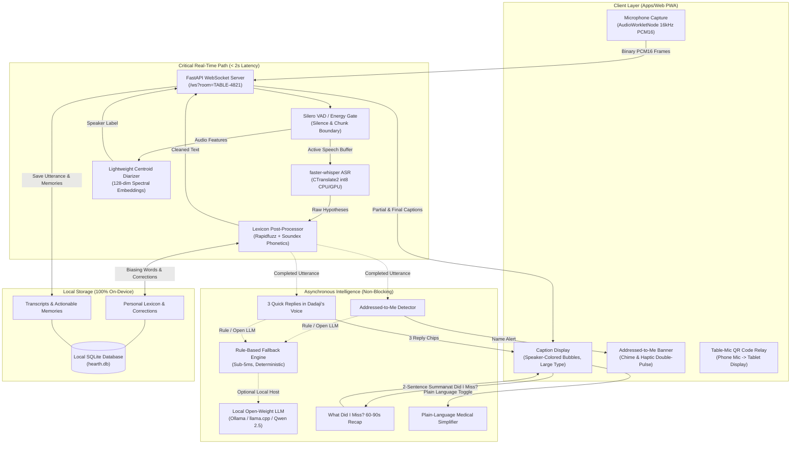

# Hearth — Architecture & Technical Design

Hearth is an offline-first, private live captioning system designed for Ramesh ("Dadaji"), a 76-year-old grandfather experiencing age-related bilateral hearing loss in lively, multi-speaker family dinner environments.

---

## 1. Core Architecture Diagram

---

## 2. Decoupled Pipeline Design

### Principle: The Real-Time Caption Path Never Waits on an LLM
The primary failure mode of assistive speech tools is latency drift. If audio transcribing waits on an LLM completion, speech lags by 3–6 seconds, making conversational banter impossible for Dadaji to follow.

1. **Streaming Audio -> Screen (< 2s)**:
   - Microphone samples are captured via `AudioWorkletNode` in 16 kHz 16-bit mono PCM.
   - Streamed over WebSocket to FastAPI.
   - Silero VAD monitors energy envelopes. Rolling partials are emitted every 700ms.
   - At utterance boundaries (350ms silence or 8s limit), `faster-whisper` transcribes the chunk.
   - `LexiconPostProcessor` applies Rapidfuzz token matching and Soundex phonetic verification against Dadaji's 40+ personalized family words.
   - The final caption is broadcast to all room display devices immediately.

2. **Asynchronous Intelligence Layer**:
   - Once the final caption is emitted to the screen, concurrent background tasks evaluate:
     - **Addressed-to-Me Check**: Distinguishes between direct imperatives (*"Dadaji, did you take your medicine?"*) vs third-person family narration (*"Dadaji went for a walk"*).
     - **Question Detection**: Triggers 3 contextual quick reply buttons in Dadaji's calm, polite Hinglish tone.
     - **Memory Extraction**: Extracts medication reminders and clinic follow-ups as confirmable chips.

3. **Graceful Rule-Based Degradation**:
   - If an open-weight local LLM (e.g., Ollama `qwen2.5:3b`) is unreachable or exceeds a 3.0-second timeout, Hearth instantly switches to `RuleBasedLLMFallback` without dropping frames.
