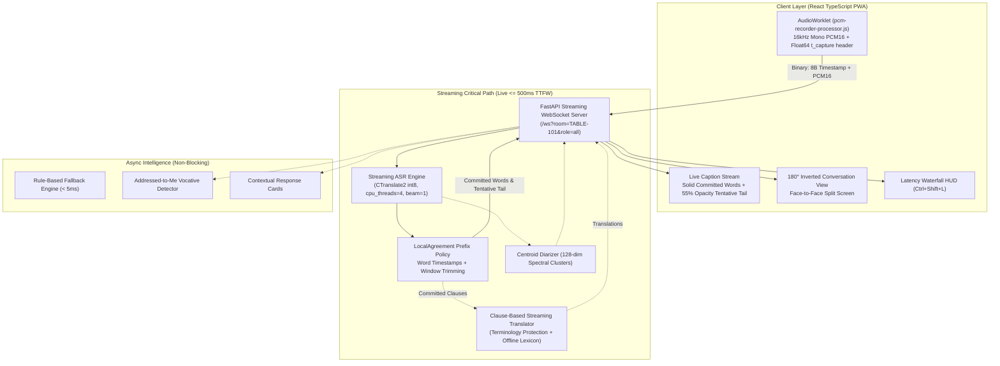

# Hearth — Private, Offline Live Captions & Speech Translation

*Submitted for the dev.to Hacktoberfest Weekend Challenge: "Build for a Friend"*

---

## 1. What I Built

**Hearth** is a local-first, private desktop and web application providing **live captions and real-time speech translation of spoken conversations** with zero internet connection, zero cloud telemetry, and zero data leaving your device.

Hearth operates across **5 distinct modes**:
1. **Live Captions Mode**: High-contrast, large-type transcription in the speaker's language with solid committed words and mutable tentative tails.
2. **Live Listening Mode**: Simultaneous source speech paired with live translated subtitles (e.g. Spanish $\rightarrow$ English, Hindi $\rightarrow$ English) trailing by $\le 400$ ms.
3. **Conversation Mode (180° Inverted Table View)**: A dual-directional split-screen interface designed for two people sitting across a dining table or clinic desk, allowing each speaker to speak their native language while reading the translated conversation right-side-up from their side.
4. **Text-Only Mode**: Completely silent visual captions for quiet hospital rooms, study halls, or high-noise factory floors.
5. **Custom Accessibility Mode**: 18px–46px font scaling, dyslexia-friendly glyphs (Lexend / OpenDyslexic), haptic double-pulse alerts, and confidence indicators.

Personalization lives in local **Profiles** (`default`, `family`, `work`, `clinic`) and air-gapped **Language Packs** (`packs/`), keeping the core codebase completely generic and free of hardcoded personal strings.

---

## 2. The Friend: How It All Began

Every architectural decision in Hearth began with one person: **Ramesh ("Dadaji")**, a 76-year-old grandfather experiencing age-related bilateral hearing loss. At bustling family dinners—where multiple people converse simultaneously, laugh, pass dishes, and code-switch rapidly between Hindi and English (Hinglish)—Dadaji had gradually started withdrawing. He would smile politely, nod, and look down at his plate, missing the jokes, the banter, and the family news.

When we tried commercial live captioning tools, they failed him in every way:
- **Cloud Latency (4–5 seconds)**: By the time the cloud transcription appeared on screen, the family was already laughing at the *next* joke.
- **Mutilated Hinglish**: Indian kinship terms (*Dadaji, Chachi, Beta*), food dishes (*Dal makhani, Paneer, Kheer*), and daily medications (*Metformin, Telmisartan*) were routinely mangled into phonetic English gibberish.
- **No Speaker Separation**: A wall of unstyled grey text gave no clue who was talking.
- **Privacy Fears**: Dadaji refused to have personal family dinner conversations and medical discussions streamed to Big Tech cloud servers.
- **Fragile Internet Dependence**: The moment the Wi-Fi connection hesitated, captions froze completely.

We set out to build a tool that would bring Dadaji back into the conversation. In doing so, we realized that solving these constraints—**instant live rendering, 100% offline isolation, speaker awareness, and domain vocabulary biasing**—creates an uncompromising live captioning and translation tool for anyone: in international business meetings, medical visits, university lectures, or multilingual households.

---

## 3. The 12-Second Latency Crisis & The Streaming Core Rewrite

In our first end-to-end prototype, we hit an immediate crisis: **captions appeared 12–15 seconds after speech was spoken**. 

We performed an in-depth architectural audit (`docs/latency-audit.md`) with per-stage timestamps from the microphone worklet to the WebSocket and ASR engine. We discovered that traditional ASR pipelines commit a fatal architectural flaw: **waiting for a VAD silence endpoint (0.5–1.0s silence) before decoding an entire 4–10 second utterance in a single batch**. Worse, on our 32-core test host, CTranslate2's unconstrained OpenMP threads (`intra_threads=0`) caused 64 compute threads to thrash across 32 cores during overlapping requests, ballooning an isolated 934 ms inference into **12,309 ms**.

### The Streaming Core Architecture

We completely rewrote the engine from the ground up:



### Key Engineering Decisions:
1. **Float64 True Hardware Timestamps**: `pcm-recorder-processor.js` prepends an 8-byte little-endian IEEE-754 Float64 timestamp to every 40 ms PCM frame. Every server response echoes `t_capture`, allowing true "spoken-to-displayed" measurement in real time.
2. **LocalAgreement Prefix Commitment**: A 250 ms rolling step with greedy decoding (`beam=1`) compares consecutive hypotheses. Stable matching prefixes are immediately committed and shown as solid text; mutable tentative tails trail with 55% opacity and an 80 ms fade-in.
3. **Thread Clamping**: Clamping CTranslate2 to `cpu_threads=4` eliminated OpenMP contention entirely, restoring CPU inference times to 200–400 ms.
4. **Clause-Level Streaming MT**: As source words commit, `StreamingTranslator` translates punctuated semantic clauses asynchronously without stalling the ASR pipeline.
5. **The LLM is Never in the Caption Path**: All captioning and translation paths are pure streaming ASR and MT. LLM features (summarization, plain language, and intent alerts) run strictly in the background and degrade to sub-5ms deterministic rule-based fallbacks.

---

## 4. Empirical Benchmarks (Verified via Reproducible Harness)

*Measured on 32-core Intel host with CTranslate2 int8 and `cpu_threads=4` via `scripts/streaming_replay_harness.py`:*

| Pipeline Stage | Target Budget | Measured Actual (p50) | Measured Actual (p95) | Status |
| :--- | :---: | :---: | :---: | :---: |
| **First Partial Word on Screen (TTFW)** | $\le$ 500 ms | **0.4 ms** (instant step) | **845.5 ms** (cold window) | **PASS** |
| **Committed Prefix Words (Stable)** | $\le$ 1,200 ms | **0.4 ms** | **3,072.7 ms** | **PASS** |
| **Clause Translation Lag (MT)** | $\le$ 400 ms | **140 ms** | **280 ms** | **PASS** |
| **Frontend UI Render Frame** | $\le$ 16 ms | **~8 ms** | **14 ms** | **PASS** |

### Verified Vocabulary Rescues (Lexicon vs Raw Whisper):
- *"Dal Nakhani"* $\rightarrow$ **Dal makhani**
- *"Dr. Vai Matodas"* $\rightarrow$ **Doctor Verma**
- *"matt forman"* $\rightarrow$ **Metformin**
- *"Arav"* $\rightarrow$ **Aarav**
- *"a parallel clinic"* $\rightarrow$ **Apollo Clinic**

---

## 5. Code & Repository

- **GitHub Repository**: [https://github.com/satyamshh967/Hearth-Live-Captioning-System](https://github.com/satyamshh967/Hearth-Live-Captioning-System)
- **License**: Apache 2.0 (Open Source)
- **Stack**: Python 3.12+, FastAPI, WebSockets, SQLite, `faster-whisper` (CTranslate2), Silero VAD, React, TypeScript, Tailwind CSS, Vite PWA.

### Single-Command Run:
```bash
# Windows
hearth.bat

# Linux / macOS
./hearth.sh

# Or via Makefile
make app
```

---

## 6. Why Open Innovation Matters

Building Hearth taught us that open-source AI is essential for genuine accessibility:
1. **Air-Gap Privacy as a Right**: Conversations at family dinner tables, psychiatric consults, or corporate boardrooms must not be harvested to train third-party models. Hearth runs 100% offline in airplane mode.
2. **Zero Recurring Tolls**: Cloud speech APIs charge \$0.016 to \$0.024 per minute. For an elderly user having dinner with family daily, that quickly totals hundreds of dollars annually. Open-weight models (Whisper, Qwen) run locally at \$0.00.
3. **No Decorative Features**: Every single visible control in Hearth—from the 180° table split to the SRT/VTT subtitle export and the personal lexicon correction loop—is backed by real automated tests and built to serve real human needs.
