# Hearth Latency Audit & Root-Cause Waterfall

> **Audit Date**: October 5, 2026  
> **Environment**: Windows 11 (Build 26200), Intel64 32 Logical Cores, Python 3.12.10, FastAPI + Uvicorn, CTranslate2 4.8.2, faster-whisper 1.2.1.  
> **Audio Corpus**: `eval/recordings/` 16-bit PCM clips (4.2s to 4.8s utterances).

---

## 1. Executive Summary: Where Did the 12–16 Seconds Go?

In the initial implementation, captions appeared on screen **10.8 to 16.7 seconds** after a speaker began speaking. For a 4.5-second conversational sentence, the user experienced a 12-second total blackout before any final text was displayed.

The latency audit reveals that this delay was **not caused by a slow ML model in isolation** (Whisper `base` int8 on this machine decodes 4.5s in 934ms when serialized). Instead, the latency was the compounded result of **structural architectural flaws** across the pipeline:

```
[Spoken Utterance Timeline]
0.0s ───────────────────────────────► 4.5s (Speech Ends)
      │                                 │
      ▼                                 ▼
   Speech in Progress            Silence Wait (VAD)
   [No stable text shown]        [+400ms to 600ms]
                                        │
                                        ▼
                                 Utterance-End Triggered
                                 Full 4.5s Audio Buffer Sent to Whisper
                                 OpenMP Thread Collision (64 threads on 32 cores)
                                 Inference Time Ballooned: 934ms ──► 12,309ms!
                                        │
                                        ▼
                                 Final Caption Displayed at:
                                 t = 4.5s + 0.5s + 12.3s = 16.7s!
```

---

## 2. Empirical Waterfall Measurements

All numbers below were captured using the real-time WebSocket test harness (`scripts/audit_latency_breakdown.py`) streaming 16kHz mono audio in 100ms frames at 1x real-time playback:

| Stage | clip_01 (4.42s) | clip_03 (4.52s) | clip_08 (4.84s) | Target (Streaming) |
|---|---|---|---|---|
| **Audio Speech Duration** | 4,423 ms | 4,518 ms | 4,843 ms | *Continuous* |
| **Time to First Partial Word** | **2,346 ms** | **None** (timeout) | **None** (timeout) | **$\le$ 500 ms** |
| **VAD Silence Wait (Endpointing)** | 400 ms | 450 ms | 400 ms | **$\le$ 200 ms** |
| **ASR Inference (`base` int8)** | **9,742 ms** | **12,309 ms** | **5,989 ms** | **$\le$ 800 ms** |
| **Diarization (Spectral Centroid)** | 2.0 ms | 2.0 ms | 1.0 ms | $\le$ 15 ms |
| **Lexicon SQLite & Post-Processor** | 0.6 ms | 1.0 ms | 0.0 ms | $\le$ 5 ms |
| **Network Egress to Client** | 1.1 ms | 1.0 ms | 1.6 ms | $\le$ 5 ms |
| **Total Delay from End of Speech** | **5,960 ms** | **11,661 ms** | **2,075 ms** | **$\le$ 400 ms** |
| **Total Perceived Latency (from $t_0$)** | **10,822 ms** (10.8s) | **16,660 ms** (16.7s) | **7,396 ms** (7.4s) | **Live Streaming** |

---

## 3. Deep-Dive Audit of the 8 Root Causes

### Root Cause 1: Whole-Utterance Decoding After VAD Endpoint
- **Mechanism**: The pipeline accumulated raw PCM bytes in an unbounded `bytearray` until an energy-based VAD registered 400ms of silence (or hit an 8-second hard cap). Only *after* the speaker stopped talking did the system send the entire multi-second audio buffer to Whisper.
- **Impact**: Even if inference were instantaneous, waiting for a 6-second sentence to finish plus 400ms silence immediately introduces a **6.4-second baseline delay** before decoding even starts. Words spoken at second 1.0 were held captive in memory for over 6 seconds.

### Root Cause 2: OpenMP Thread Explosion on 32-Core Machine
- **Mechanism**: The host machine possesses 32 logical cores. By default, CTranslate2 (`faster-whisper`) initializes OpenMP with `intra_threads=0`, automatically assigning 32 compute threads per model instance.
- **The Collision**:
  - While speech was incoming, `_run_async_partial` launched `transcribe_stream` via `asyncio.to_thread` (Worker Thread A $\rightarrow$ 32 OpenMP threads).
  - When the VAD endpoint triggered, `_run_async_final` launched `transcribe` via `asyncio.to_thread` (Worker Thread B $\rightarrow$ another 32 OpenMP threads).
  - 64 CPU-bound threads simultaneously saturated the 32 cores, causing severe memory bus contention, L3 cache eviction, and OS thread context switching.
- **Proof**: 
  - Standalone isolated single-call inference on `clip_03`: **934 ms**.
  - During concurrent streaming thread collision: **12,309 ms** ($\mathbf{13.1\times}$ slowdown!).

### Root Cause 3: Model Size vs. CPU Compute Types (fp32 vs. int8)
- **Empirical Benchmarks** (on 4.52s audio clip with `cpu_threads=4`):
  - `faster-whisper tiny` int8: **497 ms** (RTF: 0.11)
  - `faster-whisper base` int8: **934 ms** (RTF: 0.21)
  - `faster-whisper base` fp32: **2,180 ms** (RTF: 0.48)
  - `faster-whisper small` int8: **2,950 ms** (RTF: 0.65)
- **Finding**: Running fp32 on CPU doubles inference latency without measurable accuracy benefit over int8 quantized matrix multiplication. For low-latency streaming on CPU, `int8` with constrained thread count ($\le 4$) is mandatory.

### Root Cause 4: Lack of Stable Partial Word Commit Policy
- **Mechanism**: `_run_async_partial` took only the trailing 2.0 seconds of audio (`audio_buffer[-32000*2:]`) and ran Whisper on it with `beam_size=1`.
- **Failure**:
  1. The trailing 2.0-second slice lacked historical acoustic context, causing Whisper to hallucinate or misrecognize prefix words.
  2. The UI received fragmented partials that were discarded or replaced on every 800ms cycle.
  3. No stable prefix was ever "committed". The permanent caption bubble was only instantiated upon receiving the `final` event.
  4. In `clip_03` and `clip_08`, the partial worker thread was still stuck when speech ended, resulting in **0 partials received** by the client.

### Root Cause 5: Blocking SQLite Reads on Asyncio Event Loop
- **Mechanism**:
  - `ws.py` line 284: `prompt = self.lexicon_store.get_prompt_biasing_string()` executed `SELECT * FROM lexicon` synchronously on disk on the main event loop thread.
  - `post_processor.py` line 30: `lexicon_items = self.lexicon_store.get_all()` executed another synchronous SQLite disk read for every utterance.
  - `session_store.append_utterance(...)` executed disk writes on the event loop.
- **Impact**: Disk I/O jitter blocked the WebSocket event loop from receiving binary audio frames, causing frame packet drops and jitter in VAD energy calculation.

### Root Cause 6: RapidFuzz Fuzzy Matching on Event Loop
- **Mechanism**: `LexiconPostProcessor.process_result()` executed regex substitutions, Soundex calculations, and `rapidfuzz.process.extractOne` over the entire dictionary for every recognized token directly on the event loop.
- **Impact**: While lightweight for short sentences (1–3ms), matching longer 20-word transcripts against large vocabularies introduced synchronous event-loop freezes.

### Root Cause 7: No Process Isolation Between ASR, Diarization, and API
- **Mechanism**: The FastAPI server, WebSocket connection manager, ASR inference engine, SciPy spectrogram diarizer, and SQLite stores all resided within the **same Python OS process**.
- **Impact**: Python's Global Interpreter Lock (GIL) and OpenMP thread schedulers interfered directly with the asyncio event loop. A compute-heavy matrix multiplication in CTranslate2 degraded WebSocket packet dispatch latency.

### Root Cause 8: Unbounded Buffers and Zero Backpressure
- **Mechanism**: Incoming WebSocket frames were appended directly to `state.audio_buffer` with no maximum queue limit or rate limiting.
- **Impact**: If ASR lagged behind real-time factor ($RTF > 1.0$), audio queued up indefinitely, causing latency to grow monotonically over the session rather than shedding or compacting stale frames.

---

## 4. Latency Waterfall Comparison

```mermaid
gantt
    title Latency Waterfall: Old Architecture vs. New Streaming Core
    dateFormat X
    axisFormat %s s

    section Legacy (Current)
    Spoken Sentence (4.5s)              :done, leg1, 0, 4500
    VAD Silence Endpoint Wait           :active, leg2, 4500, 4950
    Thread-Thrashed ASR Decoding        :crit, leg3, 4950, 16660
    Final Displayed to User (16.7s)     :milestone, m1, 16660, 16660

    section Target Streaming Core
    Spoken Sentence (4.5s)              :done, st1, 0, 4500
    First Partial on Screen (350ms)     :milestone, m2, 350, 350
    Continuous Incremental Commits      :active, st2, 350, 4700
    VAD Clause Endpoint (~200ms)        :crit, st3, 4500, 4700
    Final Sentence Polished (4.8s)      :milestone, m3, 4800, 4800
```



---

## 5. Architectural Requirements for the Rewrite

To guarantee $\le 500\text{ ms}$ time-to-first-word and $\le 1.2\text{ s}$ word commit latency:

1. **Process Isolation**:
   - ASR engine runs in a dedicated worker subprocess (`multiprocessing.Process`).
   - Communication via IPC queues or shared memory buffers.
   - The FastAPI/Uvicorn process handles only networking, WebSocket routing, and UI state.
2. **True Streaming ASR Strategy**:
   - Evaluate `sherpa-onnx` streaming transducers (chunk size 160–320ms, non-autoregressive, sub-200ms latency).
   - Evaluate `faster-whisper` with a LocalAgreement streaming sliding window and prefix commitment.
   - Clamp CPU threads: `cpu_threads=4`, `inter_threads=1` to prevent CPU core starvation.
3. **Display Policy (Committed vs. Tentative)**:
   - Words matching across consecutive hypotheses are **committed** (rendered in solid text, immutable).
   - Only a mutable tail ($\le 3$ words) is tentative (rendered at ~55% opacity).
   - Text appears on screen continuously while the speaker is talking.
4. **Isolated MT Engine**:
   - CTranslate2 machine translation runs in its own worker process, trailing committed source words by clause ($\le 400\text{ ms}$).
5. **In-Memory Caching & Async I/O**:
   - Lexicon and profiles cached in RAM; zero SQLite queries during live audio stream.
   - Session transcript logging offloaded asynchronously.
6. **Hardware Calibration & Dynamic Downgrade**:
   - Calibrate device RTF on startup. If RTF $> 0.8$, automatically downgrade profile (Accurate $\rightarrow$ Balanced $\rightarrow$ Fast).
